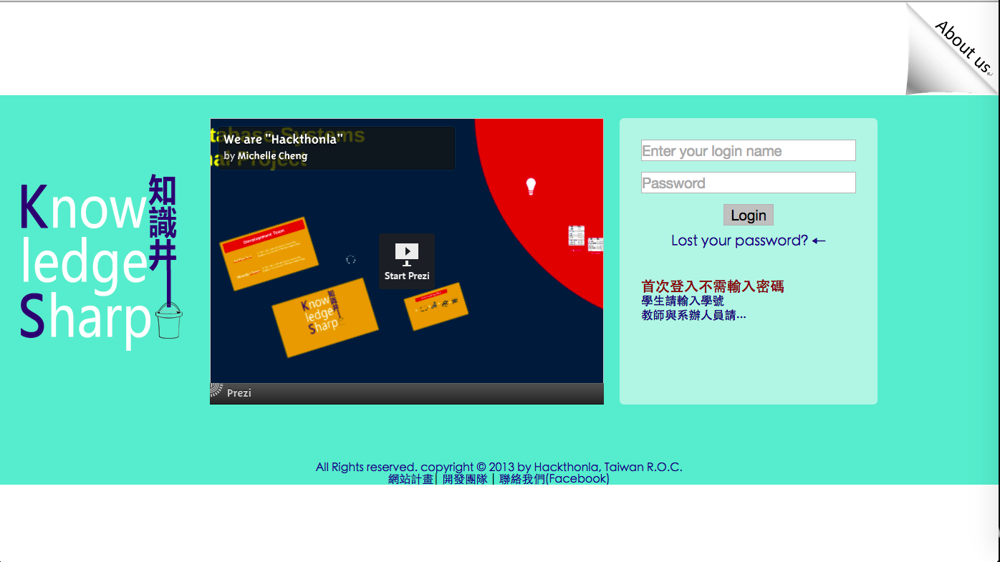

Knowledge Sharp
===============
This is a knowledge repository made for college student to share their own:
* Project experience
* higher degree persuit
* Course information 

這個專案分享台灣國內各大專院校有畢業專題的校系，各組學生的個人與組經驗, 目的是希望透過傳承經驗，提供畢業校友一個作品的線上查詢管到, 並讓學弟妹有相關於專題製作上的經驗可以諮詢

More Provision
==============
* Programming and Web Design Tutorial

Team 
==============
<Name>
Original Team: CCUMISKM @ National Cung Chen University

<Member>
* [Veck Hsiao](fbukevin@gmail.com)
* [Ray Lin](lieeray@hotmail.com)
* [Carry Wang](pudding_jj327@yahoo.com.tw)
* [Jack Wu](jacklove33@hotmail.com)
* [Mike Ho](mike78030608@yahoo.com.tw)
* [OD (MIS of Department of MIS)]

<Name>
Continue Team: Hackthonla @ SITCON 2013 Hackgen

<Members>
* [Veck Hsiao](fbukevin@gmail.com) ( National Chengchi University )   
* [Wade Chen](wade5300606@hotmail.com) ( National Chiao Tung University )
* [Michelle Cheng](cacainside@gmail.com) ( National Taiwan University )

Guide for Development
==============
1. Server information:
Operating System:       Linux Mint 16 Petra (MATE 64-bit)
Server Software:        Apache/2.4.6(Ubuntu)
Database System:        MySQL Ver 14.14 Distrib 5.5.34, for debian-linux-gn
Programming Language:   PHP 5.5.3

2. Database construction:
    (1) knowledgesharp.sql: With this pruned SQL export file, you could import it to have a testing user table and content table. 
    (2) mysql_config: This is the config file of MySql connection, you should replace the default string of password embedded into this file with your testing account password.

